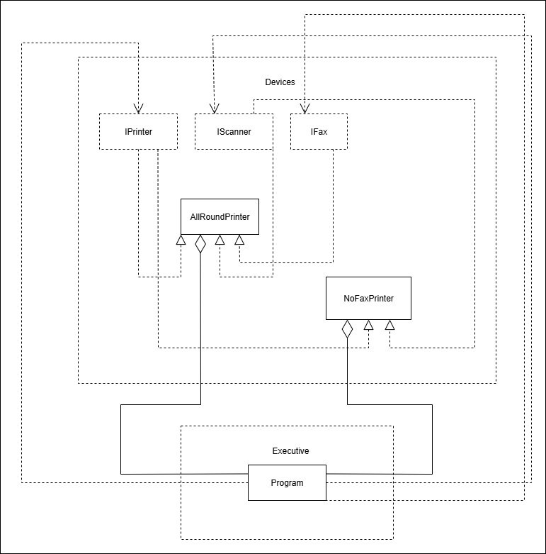

### Interface segmentation: Multi Function printer

## UML Diagram for the project

This project is an illustration of the design principle interface segmentation, 
where a multi function printer is implemented.

## Overview of the principle
Interfaces are widely used to abstract implementation details from other classes. 
But having a single interface which includes every functionality in it is a bad idea
Hence, it is advised to implement only what is required and design more interfaces to support
this idea. 

Let us say, we had a remote that controls everything in our house. Say a single remote helps
us switch on TV, Fan, Wifi and Air Conditioner. It will be a cool idea but a big problem with 
this design is this: Let us say, you want to switch on the Fan. But that would switch off the 
TV or wifi or Air Conditioner. This is definitely not desirable. Hence, a single interface
doing its own duty is the best preferred design.

In this project, there are two devices. 
1. All Round Printer: Does Fax, Scan and Print.
2. No Fax Printer: Does only Print and Scan.

These illustrate how different interfaces seperated from each other can actually build
one single complex device.

## Design
There are two modules in the project.

- Devices
    - This module contains all the interfaces and devices used in this project. These are
        - Interfaces:
            - `IFax`: The interface for a pure fax machine
            - `IScanner`: The interface for a pure scanner
            - `IPrinter`: The interface for a pure printer
        - Classes:
            - `AllRoundPrinter`: 
                - This printer supports multiple functions
                - Scanning: It can scan documents
                - Printing: It can print documents
                - Fax: It can send faxes too
            - `NoFaxPrinter`:
                - This printer supports multiple functions
                - But it does not support fax
                - Scanning: It can scan documents
                - Printing: It can print documents

- UnitTests
    - This module has unit tests for all the classes mentioned above
        - `TestAllroundPrinter`: Tests the `AllRoundPrinter` class
        - `TestNoFaxPrinter`: Tests the `NoFaxPrinter` class

## Methodology
- Printing: 
    - Once a document is provided as a string, it is stored as a variable `PrintedText` 
    in the `IPrinter`
- Scanning:
    - Once a document is provided as a string, it is stored as a variable `Document` 
    in the `IScanner`
- Fax:
    - Once a document and an telephone number are provided, a message stating 
    `Sending <document> to <telnum>` is stored in the `IFax`

## Shortcoming
Currently, no console writing or logging is used because, it made testing harder for me.
I will definitely look into testing methods logging into the console in the future.

## References
I sincerely thank this website for providing me the example on interface segmentation 
from above.
- https://www.theserverside.com/tip/The-interface-segregation-principle-A-fun-and-simple-guide

## Environment
This project runs with dotnet or Visual Studio 2022 when required workloads/tools are installed